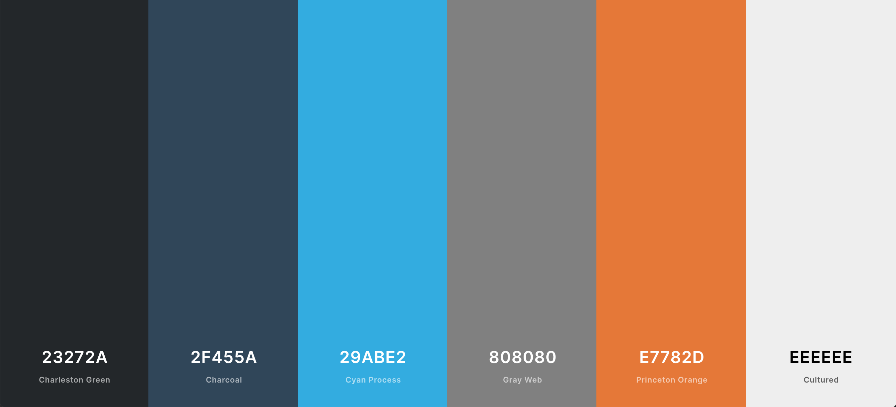
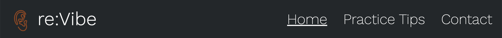
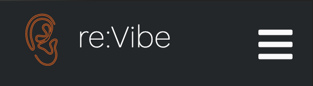
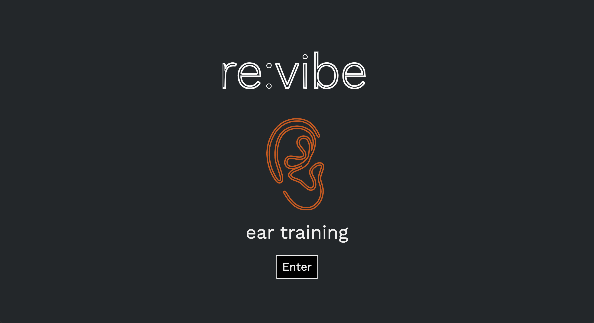
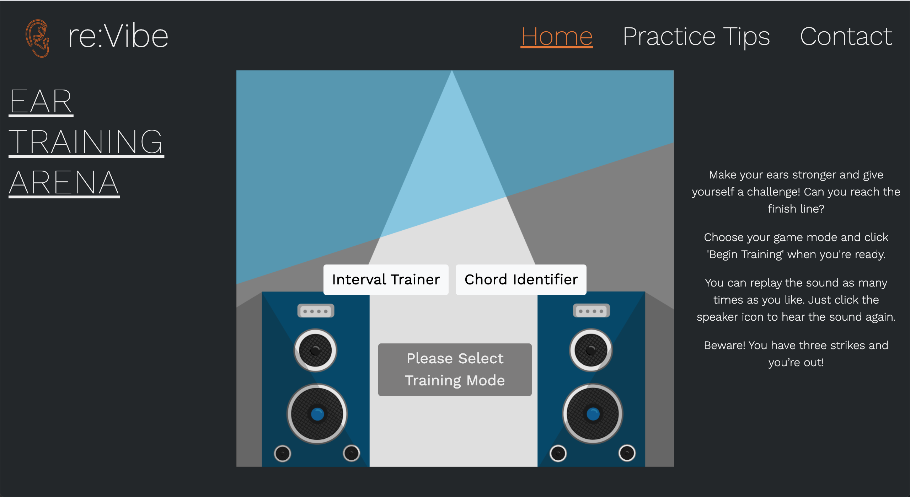
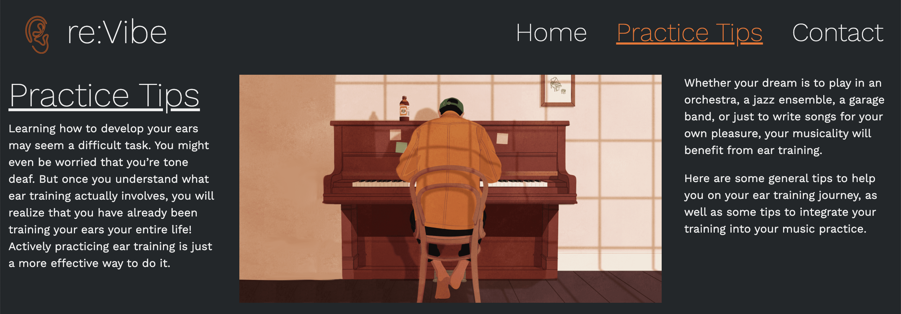
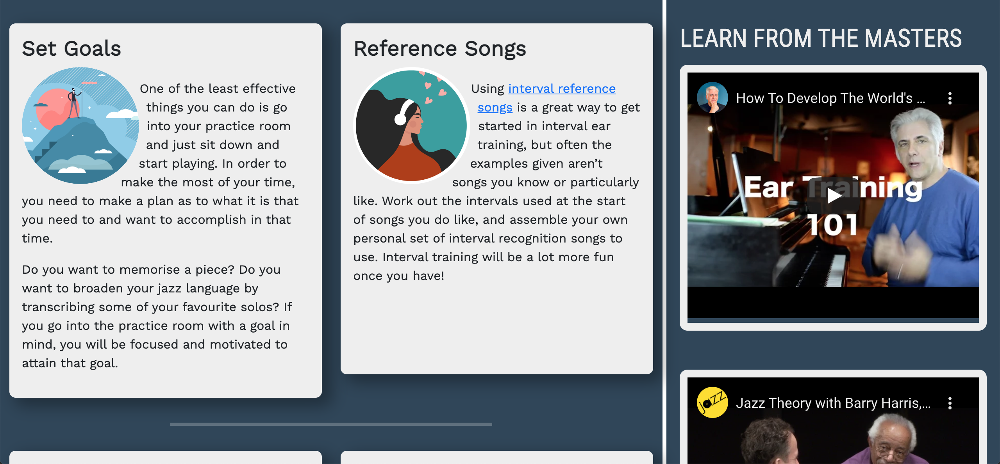
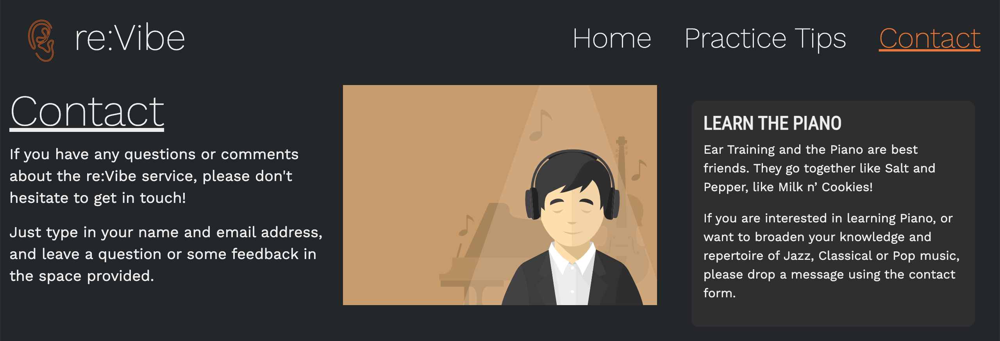
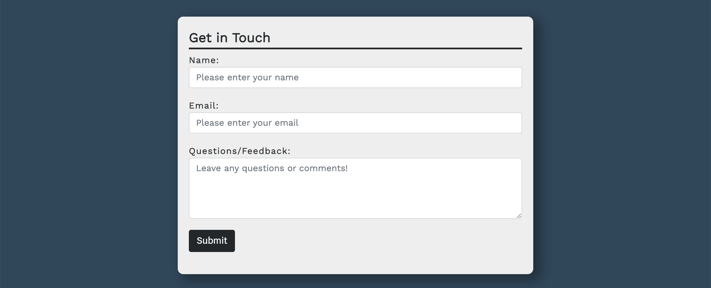

# Re:Vibe
*Re:Vibe* is an interactive ear training platform game built with HTML, CSS and JavaScript, for music students of all ages and abilities who would like to improve their ears through the exercises that Re:Vibe provides. Whether the user is taking their first steps into the world of music, or are skilled in reading music and want to improve their ability to play by ear or in an ensemble, Re:Vibe serves as a user friendly, aesthetic platform that musicians enjoy training with time after time.

The website features a welcome page, a home page holding the training platform, a page featuring tips to practice ear training, and a contact page for users to submit feedback/questions to the site owner. 

## UX

### Strategy

#### Vision

While there is certainly no shortage of comprehensive ear training websites already on the web, there are few which provide a clean, aesthetic user experience. As I myself am a musician, I have used a number of ear training websites in the past to brush up on my aural skills. However, many of the websites I have used are crammed with an abundance of large, unnecessary blocks of text content, and the colour schemes used to design the websites are visually unappealing. On top of this, the model of these platforms is more utilitarian and - for want of a better word - rather boring.

With this, the vision of Re:Vibe is to provide the user with an aesthetic and sleek learning experience, designed to minimise cognitive overload so as to maximise focus and learning retention when using the platform. Furthermore, the learning experience will be presented less like a utility, and more like a game, as it is widely documented that learning is best achieved through play.  By implementing these choices coupled with a consistent focus on UX throughout the development of the project, I hope that the end result will serve to encourage users to favour the Re:Vibe ear training platform whenever they want to hone their aural skills.

#### Site Owner Goals

1. Create a platform to inspire and pass on the owner’s experience in music to the younger generation of budding musicians.
2. To establish Re:Vibe as a trusted brand to both new and returning visitors.
3. To provide a fun, game-like learning experience that both the visitors and site owner will enjoy.
4. Provide general tips on the practice of music, and resources to inspire visitors to the website to delve deeper into the world of music.
5. Provide excellent UX to maximise visitor’s dwell time and minimise bounce rate, so as to maximise SEO and brand recognition.
6. Employ a mobile-first design, to cater to users who may be commuting or away from a desktop/laptop computer.
7. Ensure that website is responsive on all device sizes.

#### Target Audience

Potential visitors to the website could be:

1. Music students - Visitors may be studying a musical instrument, and may want to improve their recognition of pitch and chords to improve their efficiency when learning pieces of music.
2. Students preparing for an upcoming exam - as aural tests are an element of practical musical examinations, visitors may want to use the service to brush up on their aural skills for their upcoming examinations.
3. Musicians seeking to play in ensembles (particularly in the jazz idiom) - as jazz music is an art form centred around spontaneity and interplay/communication between musicians, a good foundation of aural skills is essential to a jazz musician’s repertoire.
4. Visual learners - Visitors to the website may benefit from visual indicators when learning.
5. Hobbyists who are casually interested in challenging their ears.

#### User Stories

##### Visitors

As a visitor using the website for the first time, I want…

1. The purpose of the website to be immediately apparent, so I can quickly trust that the website will suit my needs.
2. To be able to navigate the site intuitively and with ease, so that my time isn’t wasted.
3. Instructions of how to use the platform to be clearly presented, so I can start using the platform as quickly as possible.
4. Clear visual feedback when I submit either a correct or incorrect answer, so I know clearly the areas on which I need to improve.
5. The website to be visually appealing with good colour contrast, so I’m not distracted from the learning experience.
6. To see visual aids (particularly notation of the pitches and chords) when correct answer is submitted, so I can better internalise my learning.
7. The learning experience to be engaging and challenging, so that I am stimulated by the experience.

As a returning visitor, I want...

1. To be able to create a profile on the website, so I can save and keep track of my progress.
2. To easily navigate to a contact form, so I can give positive or negative feedback, or ask any questions.
3. Learn more about the different aspects of aural training and music practice in general, so I can build more on my experience and knowledge of the musical discipline.
4. To see a leaderboard in the challenge section, detailing the high scores submitted by other users of the website, so that I feel stimulated and challenged.
5. To be kept up-to-date about any new features that have been added to the website.

##### In or Out?

Below is a table to weight the importance of features in first release, against the feasibility of implementation.

| Feature/Opportunity | Importance (score out of 5) | Feasibility/Viability (score out of 5) | In or Out? |
|---|---|---|---|
| Introduction/welcome page stating the role of the website | 4 | 5 | In |
| Graphical User Interface (GUI) to hold the training exercises | 5 | 5 | In |
| Interval Training Mode | 5 | 5 | In
| Chord Training Mode | 5 | 5 | In
| A score tally of correct or incorrect answers | 5 | 5 | In |
| Symbols to indicate how many lives the user has left | 5 | 5 | In |
| Audio cues when a user submits a correct/incorrect answer | 3 | 5 | In |
| A visual display of the musical notation when a correct answer is submitted | 5 | 4 | In |
| Modal pop up windows when a challenge is completed or when the user has lost all their lives | 5 | 5 | In |
| Degrees of difficulty ranging between Beginner, Intermediate and Advanced | 4 | 3 | Out |
| Challenge mode (timed run of musical interval/chord recognition exercises) | 3 | 2 | Out |
| Leaderboard for registered users to display their high scores | 1 | 0 | Out
| A page detailing practice tips/general resources to inspire musicians | 2 | 5 | In |
| Functionality for user to create a profile to save and track their progress | 4 | 0 | Out |
| A contact page for users to get in touch with site owner | 5 | 5 | In |
| 404 Page | 5 | 5 | In |
| **Total** | 61 | (Average viability x Number of Items) 59 |

### Scope

Unfortunately, due to the trade-offs the developer has to take into consideration, the first release of *Re:Vibe* will not feature many of the training modes that are features on competitor's websites. Therefore, the first release will be modeled as a game as opposed to a fully comprehensive training platform. The pitfall of having these trade-offs in the first release will hopefully be offset by the enjoyable user experience, in comparison to competitor's websites.

Main features for a Minimal Viable Product:

* Welcome landing page
* Graphical User Interface
* Interval Training Mode
* Chord Training Mode
* Score tally
* Lives-left symbols
* Audio cues for correct/incorrect answers
* Visual "reveal" of musical notation when correct answer is submitted.
* Modal Popups for Completed Games/Game Over
* Practice Page
* Contact Page
* 404 Page

Features for future releases:

* Difficulty modes (Beginner, Intermediate, Advanced) - This is the most important feature to be implemented, and will be implemented in the first release should the developer have enough time and resources before deadline.
* Challenge Mode
* Functionality/database for user to create profile, and save their progress
* Melody Matching 
* Rhythm Identifier 
* Jazz Progressions Identifier 
* Scale Identifier
* Perfect Pitch Training

### Structure

The structure of the website is listed in the bullet-points, in order from top to bottom level.

1. Landing Page

The first page the user will see when entering the page. This page contains:

* Brand logo

* Image of a sleek, one-line drawing of an ear.

* Call-to-action button inviting the user to enter the platform.

2. Home/Game Page

   1. Main Page

* Navigation Bar - A navigation bar will be displayed at the top level of the page, with the brand logo on the far left, and navigation links on the far right. Will collapse to hamburger icon with dropdown list on mobile screen sizes.

* Game Instructions - A short, concise overview of how to use the platform will be displayed. 

* Graphical Use Interface (GUI) - Where the game/training will be undertaken.

* Footer - Social media/Github Links will be displayed at the bottom level.

   2. Modal Windows (displayed when user completes game, or game is over)

   * Header - Congratulating or commiserating visitor.

   * An elaboration on the congratulations or commiserations.

   * An invitation to play again, or try the chord identifier.

3. Practice Tips Page 

* Navigation Bar

* Two pieces of content side-by-side: on the left, a graphic illustration of a character practicing a musical instrument, and on the right, some tips on how to practice an instrument effectively.

* Footer

4. Contact Page

* Navigation Bar

* A short paragraph inviting the user to submit any questions or feedback.

* Contact form in the center of the page

* The developer's Github details

* Footer

### Skeleton

Links to the wireframes are listed below:

* [Landing Page](assets/wireframes/revibe-landing.pdf)
* [Home/Game Page](assets/wireframes/revibe-homepage.pdf)
* [Practice Tips Page](assets/wireframes/revibe-practicetips.pdf)
* [Contact Page](assets/wireframes/revibe-contact.pdf)

### Surface

#### General Considerations

When considering the design decisions in the context of a colour palette, it was of course surmised that the Home Page - which holds the Graphical User Interface where the game is played - was the critical page to consider. Since the primary purpose of the re:Vibe website is focused on providing an engaging learning experience, the decision was made to use a background color that would represent a 'dark' mode theme, using HEX Color #23272A. 

The colour theme for the GUI is, in contrast, relatively bright. This contrast would hopefully result in maximum engagement and attention to the game, and provide an experience which is easy on the eyes, and minimal in cognitive overload. Since the game is designed to be a fairly challenging learning experience,  it is important that unnecessary cognitive overload is minimised.

Since the primary consideration of the colour choices was centered around the Home Page, the colour palette of the Practice Tips, Contact and 404 Page were ultimately determined by these initial considerations.

### Colour Palette

* #23272A (Charleston Green) - This was the colour used for the Navigation Bar, and the entire background in the Title Page and Home Page, as well as in the headers of the Practice Tips and Contact Pages. This colour defines the 'dark mode' theme of the website. 

* #2F455A (Charcoal) - This colour is featured in the Practice Tips and Contact Pages, to provide a small contrast between the primary background color used in the headers, and so provide a distinction between the two sections of each page.

* #29ABE2 (Cyan Process)  - This color is used in the background image for the Home Page's GUI, selected again to contrast against the dark background.

* #808080 (Gray Web) - Another color used in the development of the background image for the GUI, this color was also used for the collapsible Navigation Bar on mobile devices, as it was found upon testing that using the same #23272A color for both the NavBar and the page's background resulted in an unappealing blend between the open Navbar and the page's backgrounds, as it was hard to distinguish where the NavBar ended and the background color started.

* #E7782D - This color was applied to the Ear SVG featured on the Title Page and in the Navbar, as well as all fontAwesome icons, and Navlink text (when a cursor is hovered over the Navlinks). It was determined that this provided a contrast between the primary background color #23272A, that was sleek and pleasing to the eye.

* #EEEEEE - This is the color used for the links and hamburger icon in the Navbar, the text content in Home Page and header section of the Practice Tips page, and also for the buttons featured in the Home Page's GUI. It was also used as the background color for the practice tip cards in the Practice Tips page, and the contact form in the Contact page. 

### Fonts

* Work Sans - This is the primary font used for the re:Vibe logo, the buttons in the GUI, and most of the text content in the website, and for the links in the navigation bar. It was chosen for it's neutrality and sleek aspect which is pleasing to the eye, and when coloured using #EEEEEE, compliments the dark backgrounds nicely.

* Roboto Condensed - This was chosen as a secondary font, used in the headers in the GUI (Interval Trainer & Chord Identifier). It was also used as the sub-header for the card 'Learn Piano' in the website's Contact Page. The font was chosen to provide a variation, and emphasis between the roles of features in the website.

### Images

The re:Vibe website makes heavy use of vector images. The vector image used in the GUI was created using Adobe Illustrator, and was designed to mimic a stage with two speakers and representation of a spotlight which 'shines' on the buttons that the user interacts with.

The images used in the headers for the Practice Tips and Contact page were selected to provide a sense of calm and peace, which is important when practicing and playing music.

# Features

## Global Features

### Navbar

Each page features a responsive navigation bar, with a clickable logo icon positioned on the left on iPad and Laptop device sizes and up. The logo is centered on mobile device sizes.

The navigation bar collapses to a CSS-made burger icon which opens a collapsible dropdown list of the links.
The burger icon animates to a cross when clicked, to provide user feedback when the icon is clicked and the collapsible dropdown list is opened.

### Footer 

A footer is present on all pages, featuring social media links represented by fontAwesome icons, which transition to a white color when hovered. The name of the developer is also featured using the lightest weight of the 'Work Sans' font.

## Title Page

This is the first page where the user lands upon visiting the website. It features two animate SVGs, which draw the re:Vibe logo, before a button fades in, inviting the user to enter the website. The animation is intended to provide a sleek entrance into the website, and to simply and concisely state the purpose of the website, and re-inforce the brand.

## Home Page

The home page feature the main GUI where the game takes place. To the right of the GUI, a brief summary of instructions are featured to inform the user of how to use the platform. Each portion of the page collapses to a full-width column on mobile devices.

Currently, a modal window is displayed upon page load, informing users on iOS Safari that they made need to click the icon once to hear the first sound (they will not need to do this for the rest of the game). This is a temporary measure, until the bug which resulted in the inclusion of this modal message is squashed.

### Graphical User Interface

https://user-images.githubusercontent.com/79907183/129479108-a704c5aa-a12a-4ddf-b517-3c10fdc5f665.mp4

Here, the user is invited to select two game modes - Interval Trainer, or Chord Identifier. The user can only begin training when they have selected a game mode, at which point the button 'Please Select Training Mode' becomes enabled, changes colour and text content to 'Begin Training'. 

When the user clicks the 'Begin Training' button, an opaque overlay is added to draw the user into the action, and a countdown is started to give the user time to settle into the game. When the countdown is complete, the game starts, and an interval/chord is played (based on the game mode selected). 

A display of how many correct answers remain is added to the GUI, along with three font awesome 'user' icons, representing how many lives the user has left.

The font awesome speaker icon is animated with a 'heartbeat' animation, to provide additional feedback that the sound is played. This icon can be clicked to replay the sound, and can be clicked as many times as the user wishes.

When the user selects a wrong answer, the speaker icon wobbles and a sound is played to represent a wrong answer. Additionally, a life is lost (represented by the removal of a font awesome 'user' icon), and a message is displayed informing the user of how many lives are remaining. 

When the user selects a correct answer, a sound is played to represent a correct answer, and the speaker icon is hidden, and replaced with the name of the interval/chord, along with an image of the notation of the correct interval/chord. This is animated to provide a smooth experience.

https://user-images.githubusercontent.com/79907183/129479466-b6d55d4b-d305-4834-8882-76924647792b.mp4

If the user answers all 10 intervals/chords correctly, a congratulatory bootstrap modal window is displayed, with a short congratulatory message along with information on how many lives they had remaining when they completed the game. Additionally, a list of the correctly identified intervals/chords is displayed in a window for the user to browse at their will. At the bottom of the modal, the two buttons are featured, inviting the user to play the game again (which initiates the countdown when clicked) or close the modal window and browse at their will, or pick another game mode.

A short, cheerful jingle is played to represent that the game is complete.

https://user-images.githubusercontent.com/79907183/129479507-f102a6f3-a96e-4ce8-b527-a51f42efcd82.mp4

If the user loses all three lives, a commiseratory bootstrap modal window is displayed, with a short commiseratory message. This also features a list of the correct intervals/chords that the user identified correctly. This modal also features buttons inviting the user to Try Again (which initiates the countdown when clicked), or close the modal window and browse at their will, or pick another game mode.

A short, sad jingle is played to represent that the game is over.

## Practice Tips Page

The practice tips page features two sections.

The first section of the practice tips page features a top-level header, and a summary of the concept of ear training and it's importance. This is accompanied with a graphic illustration of a man playing the piano. This particular image was selected to convey a sense of peace, calm and focus.

The second section features individual cards displaying information about how to practice ear training effectively, as well as information on how to integrate ear training into general music practice. The cards are displayed within a white background, with box-shadow to contrast clearly against the darker background. On the right is a side bar featuring videos, as an extra educational resource for the user to visit if they so wish. 

## Contact Page

The contact page also features two sections.

The first section features a top level header, with a brief invitation for the user to get in touch with any questions, ideas or comments. A small sub-section of the header is dedicated to a brief invitation to the user to get in touch if they would like piano lessons. This feature is hidden on mobile devices. This text content is accompanied with a vector graphic of a person listening to music with headphones. Again, this image was selected to provide a sense of peace and calm. 

The second section features a simple bootstrap contact form, sat in a light background with some box-shadow, to contrast clearly against the darker background.

