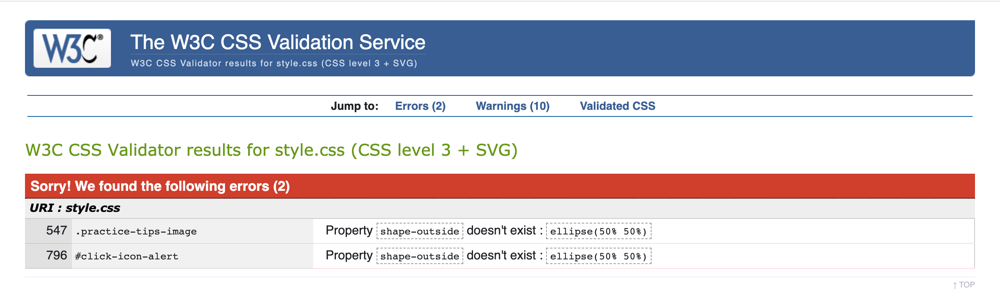
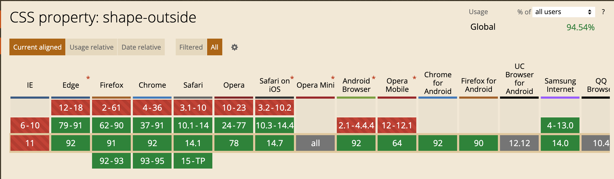
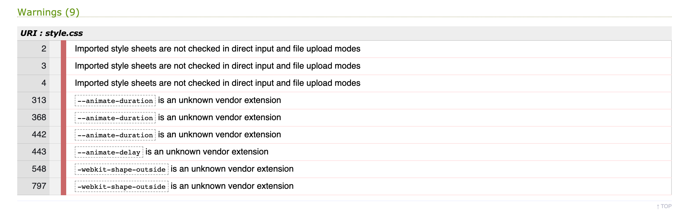
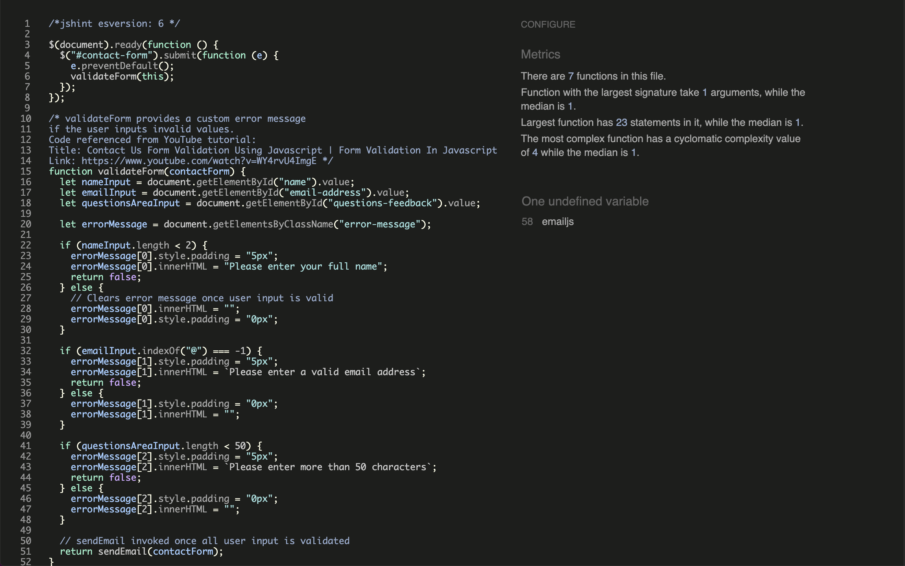
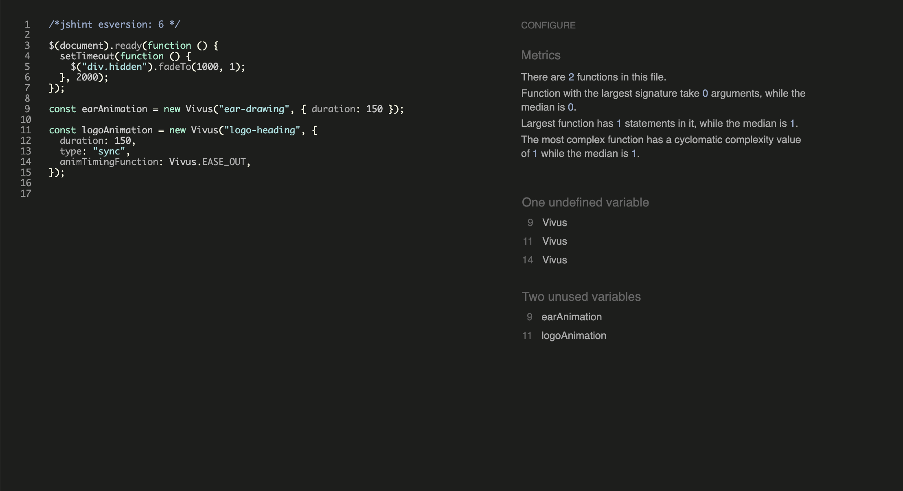
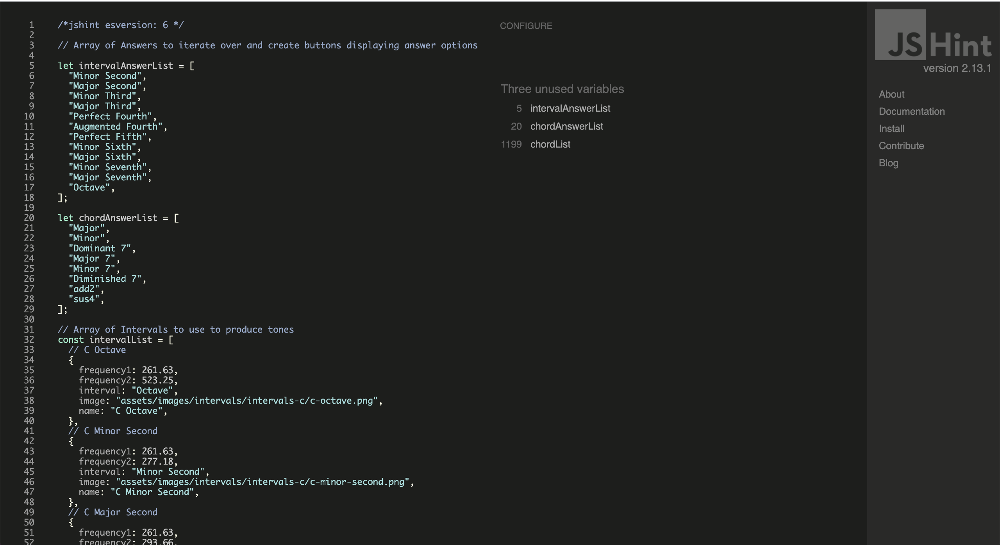
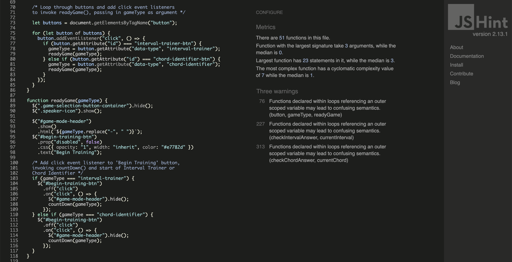

# Testing

## Markup Validation

### HTML and CSS

Both W3C HTML and Jigsaw CSS Markup Validators were used to check the validity of the source code:

#### W3C - Passed with no issues

#### W3C Jigsaw Issues

Some errors were thrown when using certain CSS properties on some elements of the page. 

The 'shape-outside' property was used on two classes with float properties, to provide a smooth text-wrap around the images. However, the Jigsaw validator states that these properties don't exist.

Upon discovering this error, the developer consulted the Slack community, and the validity of the 'shape-outside' property was checked with the website 'https://www.caniuse.com'. It was confirmed that this property has cross-browser compatibility, and it's usage wasn't violating best-practice principles. With this, the 'shape-outside' property was not removed from the style.css file.

The Jigsaw validator also threw some warnings with regards to some properties that were used to control the animation time of the elements animated using the 'animateCSS' library, namely the following properties:

* '--animate-duration' and '--animate-delay' - These properties pertain to the animateCSS library, to control the duration and timing of their animations. 

* '-webkit-shape-outside' - This property was applied to elements with the 'shape-outside' property, to ensure cross-browser compatibility.

Since the warning states that the properties are an unknown vendor extension, it was surmised that these properties are unknown to the Jigsaw validator, and so were not seriously violating any best-practice priniciples. To confirm this definitively, the website was tested on all main browsers, and no issues were found.

### JS Hint Validation

The JSHint service was used to lint and validate the JavaScript source code used to develop this project.

#### JS Hint Issues

##### Unused/Undefined Variables

Upon validating each JavaScript file with JSHint, there were multiple issues regarding unused and undefined variables.

The issues in the images above pertain to the external libraries used to implement Email functionality using the emailJS library/service, as well as the animation of the SVGs used in the title page (index.html). JSHint is stating that these variables are undefined due to the pertaining libraries not being recognised, as they are from an external source. 

Functionality has been checked thoroughly on all main browsers, and it can be confirmed that the code functions correctly and as expected.

Similarly to the issues regarding external libraries, JSHint is not recognising the variables in data.js as being defined or used, due to the fact that the object arrays assigned to these variables are being accessed and used by another file 'main.js'. This decision was made to keep code as organised as possible, but unfortunately results in not getting a clean result from JSHint.

##### Warnings in main.js

Three warnings were being thrown when validating the JavaScript code in main.js. These warnings are being generated by the for loops which are used to generate the buttons to start the game, and to submit the answers using the buttons. 

The severity of these warnings is hard to gauge, since I used the Code Institute's walkthrough project 'Love Maths' as a guide for creating this code. Again, I have thoroughly tested the code and have encountered no issues with regards to the functionality. Since the JSHint warning states that 'referencing the outer-scoped variable may lead to confusing semantics', the developer surmised that it was sufficient enough to explicitly state the purpose of the code in a comment.

